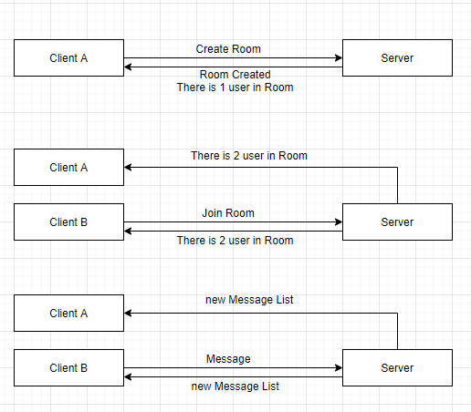
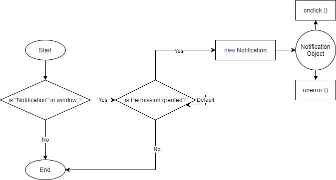

## Table of Content

1. [Description](#appinfo)
2. [Technologies](#technologies)
3. [Design](#design)
4. [Features](#features)
5. [Installation](#installation)

<a name="appinfo"></a>

## Description

The app is to let a user create a chat room and communicate with other users within the same room. There is also web notification pop-up when other users sending messages.

<a name="technologies"></a>

## Technologies

-   [HTML5 Notification](https://developer.mozilla.org/en-US/docs/Web/API/Notifications_API/Using_the_Notifications_API)
-   [create-react-app](https://github.com/facebook/create-react-app)
-   [socket.io](https://socket.io/docs/)
-   [Express js](http://expressjs.com/)
-   [React Hook useRef](https://reactjs.org/docs/hooks-reference.html#useref)

<a name="design"></a>

## Design

### Chat Room Create, Join and Communicate



### Notication



<a name="features"></a>

## Features

-   Real Time chat
-   Display how many users online
-   Notification

<a name="installation"></a>

## Installation

```
Client Side:
npm start

Server Side:
node server/server.js
```
